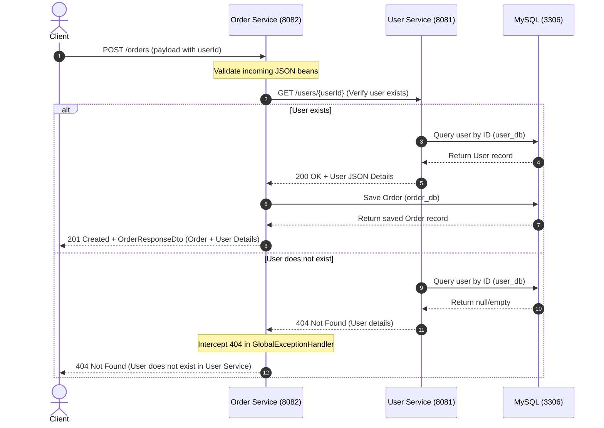

# Comprehensive Guide: User & Order Management Microservices System

This document is a complete university lab report and technical reference guide for the **User and Order Management System**, built using **Spring Boot 3.x**, **Java 17**, and a **Microservices Architecture**.

---

## PART 1 – PROJECT ARCHITECTURE & COMMUNICATION FLOW

The system is designed with two self-contained microservices: **User Service** and **Order Service**. They run in independent processes, maintain their own databases, and communicate over HTTP REST APIs.

### Architecture Overview

```
                  +------------------+
                  |  Client (cURL/   |
                  |  Postman/Browser)|
                  +--------+---------+
                           |
                           | HTTP Request
                           v
                  +--------+---------+
                  |  Order Service   | <-----+
                  |   (Port 8082)    |       |
                  +----+--------+----+       |
                       |        |            | Inter-Service
      OpenFeign Client |        | WebClient  | HTTP Call
                       |        |            |
                       v        v            |
                  +----+--------+----+       |
                  |   User Service   | ------+
                  |   (Port 8081)    |
                  +--------+---------+
                           |
                           v
                  +--------+---------+
                  |  MySQL Databases |
                  |   (Port 3306)    |
                  |  [user_db]       |
                  |  [order_db]      |
                  +------------------+
```

### Communication Flow (Sequence Diagram)

This sequence diagram depicts the flow when a client submits a request to create a new order in the **Order Service**.



---

## PART 2 – SPRING BOOT 3 MAVEN PROJECTS

Both microservices are built as Maven projects with Java 17 and Spring Boot 3.3.1. 

* **Project 1: UserService**
  * Group: `com.cognizant`
  * Artifact: `user-service`
  * Default Port: `8081`
* **Project 2: OrderService**
  * Group: `com.cognizant`
  * Artifact: `order-service`
  * Default Port: `8082`

---

## PART 3 – DEPENDENCY EXPLANATIONS (pom.xml)

Both `pom.xml` files have been configured with the following dependencies. Here is the technical explanation for each:

1. **Spring Boot Starter Web**
   * **Purpose**: Pulls in Spring MVC, Tomcat (default embedded container), and Jackson for JSON parsing.
   * **Role**: Used to build RESTful web services.
2. **Spring Boot Starter Validation**
   * **Purpose**: Pulls in Hibernate Validator (the reference implementation of Jakarta Bean Validation 3.0).
   * **Role**: Validates user inputs on API payloads (e.g. `@NotBlank`, `@Email`, etc.) before processing.
3. **Spring Boot Starter Data JPA**
   * **Purpose**: Integrates Hibernate, Spring Data, and JDBC.
   * **Role**: Simplifies database interaction using Repository interfaces, minimizing custom SQL.
4. **MySQL Driver (`mysql-connector-j`)**
   * **Purpose**: Type-4 JDBC driver for MySQL database connection.
   * **Role**: Allows applications to talk directly to MySQL Server.
5. **Lombok**
   * **Purpose**: Compile-time annotation processor.
   * **Role**: Automatically generates getters, setters, constructors, builders, and loggers (`@Slf4j`) to keep code clean.
6. **Spring Boot Actuator**
   * **Purpose**: Adds production-ready monitoring and management endpoints.
   * **Role**: Exposes `/actuator/health` and `/actuator/info` to track application health.
7. **Spring Cloud OpenFeign (`spring-cloud-starter-openfeign`)** *(Order Service Only)*
   * **Purpose**: Declarative HTTP client builder.
   * **Role**: Generates execution logic for inter-service REST calls based on interfaces with annotations.
8. **Spring Boot Starter WebFlux** *(Order Service Only)*
   * **Purpose**: Adds Spring's reactive web framework support.
   * **Role**: Imports the `WebClient` API, which is used as the modern, non-blocking alternative to `RestTemplate`.
9. **Spring Boot Starter Test**
   * **Purpose**: Imports JUnit Jupiter, Mockito, AssertJ, and Spring Test utilities.
   * **Role**: Enables unit and integration testing.

---

## PART 4 – PROJECT PACKAGE STRUCTURES

The project structure adheres to **Clean Architecture / Layered Pattern** separation:

```
src/main/java
└── com.cognizant.userservice (or orderservice)
    ├── controller    --> REST API endpoints, inputs validation, HTTP response mappings
    ├── service       --> Business logic; interfaces separating implementation (loose coupling)
    ├── repository    --> Database CRUD interfaces mapping entities (Data Access Layer)
    ├── entity        --> Database schema mappings (JPA entities)
    ├── dto           --> Data Transfer Objects separating API payloads from database entities
    ├── exception     --> Custom exceptions and the @RestControllerAdvice global handler
    ├── config        --> Configuration beans (e.g. WebClient builder configuration)
    ├── client        --> External microservice REST clients (OpenFeign / WebClient wrappers)
    └── Application   --> Main application starter class (SpringBootApplication)
```

---

## PART 5 – DATABASE DESIGN & SQL SCHEMA

To support data isolation (a core principle of Microservices), we create two distinct databases: `user_db` and `order_db` on the MySQL server.

### Database Schema Script

```sql
-- Database creation
CREATE DATABASE IF NOT EXISTS user_db;
CREATE DATABASE IF NOT EXISTS order_db;

-- Table definition for User Service
USE user_db;
CREATE TABLE IF NOT EXISTS users (
    id BIGINT AUTO_INCREMENT PRIMARY KEY,
    name VARCHAR(100) NOT NULL,
    email VARCHAR(100) NOT NULL UNIQUE,
    phone VARCHAR(20) NOT NULL
);

-- Table definition for Order Service
USE order_db;
CREATE TABLE IF NOT EXISTS orders (
    id BIGINT AUTO_INCREMENT PRIMARY KEY,
    order_number VARCHAR(100) NOT NULL UNIQUE,
    amount DECIMAL(10, 2) NOT NULL,
    order_date TIMESTAMP DEFAULT CURRENT_TIMESTAMP,
    user_id BIGINT NOT NULL
);
```

### Relational Mapping in Microservices

> [!NOTE]
> **Logical Foreign Key Relationship**
> In a monolithic architecture, `orders.user_id` would be a physical Foreign Key pointing to `users.id`. In a microservices architecture, **physical database foreign keys across microservices are prohibited** to ensure database isolation. 
> Instead, we enforce a **logical relationship**. The Order Service holds the `userId` as a simple `BIGINT` column, and validates user existence by making an inter-service HTTP call to the User Service before committing any order record.

---

## PART 6 – APPLICATION CONFIGURATION

The properties configure database access, server ports, and logging.

### User Service `application.properties` (Port 8081)
* `server.port=8081`: Run the user microservice on port 8081.
* `spring.datasource.url`: JDBC URL pointing to MySQL database `user_db` with automated database generation configuration (`createDatabaseIfNotExist=true`).
* `spring.jpa.hibernate.ddl-auto=update`: Auto-updates database schemas to match JPA entity classes (highly useful in development).

### Order Service `application.properties` (Port 8082)
* `server.port=8082`: Run the order microservice on port 8082.
* `spring.datasource.url`: JDBC URL pointing to MySQL database `order_db`.
* `user.service.url=http://localhost:8081`: A custom property mapping the base URL of the User Service, injected into the Feign Client and WebClient config.

---

## PART 9 – MICROSERVICE COMMUNICATION (OPENFEIGN vs WEBCLIENT)

We implement service-to-service communication using two options:

### 1. OpenFeign
OpenFeign is a declarative web service client. Instead of writing HTTP connection boilerplate, you write a Java interface annotated with `@FeignClient`. At runtime, Spring Cloud generates the implementation class dynamically.
* **Mechanism**: Uses standard Spring MVC annotations (`@GetMapping`, `@PathVariable`) to construct and send the HTTP request.

### 2. Spring WebClient
WebClient is part of Spring WebFlux. It is a reactive, non-blocking HTTP client designed for modern web applications.
* **Mechanism**: Operates asynchronously, returning reactive streams (`Mono` or `Flux`). We call `.block()` to adapt the call into a synchronous, blocking flow to integrate with our blocking JPA/Servlet context.

### Detailed Comparison

| Feature | OpenFeign | Spring WebClient |
| :--- | :--- | :--- |
| **Programming Model** | Declarative (Interface-based) | Imperative / Functional (Builder-style API) |
| **Blocking / Non-Blocking** | Blocking | Non-blocking (Reactive) & Blocking via `.block()` |
| **Dependencies** | Requires Spring Cloud dependencies | Requires Spring Boot WebFlux dependency |
| **Error Handling** | Uses `ErrorDecoder` or throws standard `FeignException` | Direct `.onStatus()` chaining or catches `WebClientResponseException` |
| **Best Suited For** | Standard blocking Servlet applications (like MVC) | High-concurrency reactive microservices |
| **Pros** | Minimal code, highly readable, matches Spring controller style | Supports reactive pipelines, extremely flexible, customizable |
| **Cons** | Harder to debug, not native to WebFlux, synchronous only | Requires understanding reactive concepts, slightly more verbose |

---

## PART 10 – BEAN VALIDATIONS EXPLAINED

To guarantee data integrity, JSR-380 annotations are applied to input DTOs and validated using `@Valid` in controllers:

1. **`@NotBlank`**: Enforces that the string value is not null and has a trimmed length greater than 0. (Used on User name, email, phone, and Order orderNumber).
2. **`@Email`**: Validates that the annotated string conforms to the standard email format specification (contains `@`, domain name, etc.).
3. **`@Pattern`**: Ensures the string value matches the specified Regular Expression. We use `^\\+?[0-9]{10,15}$` to ensure that phone numbers contain only digits (between 10 and 15), with an optional leading `+` sign.
4. **`@NotNull`**: Enforces that the property is not null (used on numeric values like Order amount and userId).
5. **`@Positive`**: Ensures that the numeric value is strictly greater than zero.

---

## PART 11 – GLOBAL EXCEPTION HANDLING

The Global Exception Handlers intercept exceptions globally and return an `ErrorResponse` JSON payload:

* **ResourceNotFoundException**: Thrown when database lookup by ID yields empty results. Returns **404 Not Found**.
* **MethodArgumentNotValidException**: Thrown when controller bean validation fails. Returns **400 Bad Request** along with a detailed map of fields and their validation errors.
* **DataIntegrityViolationException**: Thrown when database unique constraints are breached (e.g. duplicate email, duplicate order number). Returns **409 Conflict**.
* **FeignException / WebClientResponseException**: Thrown when inter-service HTTP calls fail. Returns the status code returned by the User service (e.g. 404, 400) wrapped inside a structured error message indicating the external call failed.

---

## PART 12 – LOGGING BEST PRACTICES

Logging is implemented using **SLF4J** API backed by Logback. We follow these standards:
* **Never use `System.out.println()`**: It blocks thread execution, causes console bottlenecks, and cannot be filtered or redirected.
* **`log.info`**: Used for tracking user flow (e.g. receiving REST requests, successfully persisting an order).
* **`log.debug`**: Detailed debugging insights (e.g. printing mapped DTO payloads, SQL mapping logs).
* **`log.warn`**: Unexpected but non-breaking events (e.g. failing to fetch user details for an order in a bulk list).
* **`log.error`**: Captures stack traces, exception messages, and service failures.

---

## PART 14 – ACTUATOR ENDPOINTS

Spring Boot Actuator endpoints provide vital monitoring information:
1. **`/actuator/health`**: Verifies if the application and its dependencies (e.g. database connectivity) are up and running. Returns `{"status":"UP"}`.
2. **`/actuator/info`**: Exposes general application information (such as version or metadata) defined in properties.

---

## PART 15 – API SPECIFICATION DOCUMENTATION

### 1. User Service API

| Method | Endpoint | Request Body | Response Body | HTTP Status |
| :--- | :--- | :--- | :--- | :--- |
| **POST** | `/users` | `UserDto` (new user details) | `UserDto` (includes generated ID) | **201 Created** |
| **GET** | `/users` | None | `List<UserDto>` | **200 OK** |
| **GET** | `/users/{id}` | None | `UserDto` | **200 OK** / **404 Not Found** |
| **PUT** | `/users/{id}` | `UserDto` (updated details) | `UserDto` (updated fields) | **200 OK** / **404 Not Found** |
| **DELETE**| `/users/{id}` | None | None | **204 No Content** / **404 Not Found** |

### 2. Order Service API

| Method | Endpoint | Request Body | Response Body | HTTP Status |
| :--- | :--- | :--- | :--- | :--- |
| **POST** | `/orders?clientType={type}` | `OrderDto` (order details) | `OrderResponseDto` (Order + User Details) | **201 Created** / **404 / 400** |
| **GET** | `/orders?clientType={type}` | None | `List<OrderResponseDto>` | **200 OK** |
| **GET** | `/orders/{id}?clientType={type}`| None | `OrderResponseDto` (Order + User Details) | **200 OK** / **404 Not Found** |
| **PUT** | `/orders/{id}?clientType={type}`| `OrderDto` (updated details) | `OrderResponseDto` (updated fields) | **200 OK** / **404 / 400** |
| **DELETE**| `/orders/{id}` | None | None | **204 No Content** / **404 Not Found** |

*Note: `{type}` parameter can be either `feign` or `webclient` (defaults to `feign`).*

---

## PART 16 – MICROSERVICES CONCEPTS DEFINITIONS

1. **What is a Microservice?**
   An architectural pattern where a single large application is split into small, independently deployable, modular services. Each microservice focuses on a single business domain, runs in its own process, and communicates using lightweight protocols (like HTTP REST).
2. **Why Separate User and Order Services?**
   * **Domain Isolation**: Managing users has different lifecycle rates and business concerns than managing transactional orders.
   * **Scalability**: Under high-load shopping days, the Order Service can be scaled up independently without wasting resources on the User Service.
   * **Resilience**: If the Order Service database crashes, users can still log in and view profiles on the User Service.
3. **Loose Coupling**: Services should have minimal direct knowledge of each other. In our project, rather than sharing a database, Order Service queries User Service via HTTP and accepts only a logical schema.
4. **High Cohesion**: Each service must do one thing well. The User Service focuses purely on user data management. It does not handle cart checkouts or invoice payments.

---

## PART 17 – TROUBLESHOOTING & COMMON ERRORS

1. **Database Connection Failed (`java.net.ConnectException`)**
   * **Cause**: MySQL server is not running or port 3306 is blocked.
   * **Solution**: Verify database status via command line (`docker ps` or status checker) and confirm credentials in `application.properties`.
2. **Port Already in Use (`BindException`)**
   * **Cause**: Another service or IDE process is running on port 8081 or 8082.
   * **Solution**: Kill the process (`kill $(lsof -t -i:8081)`) or assign a different port using `server.port` in properties.
3. **Feign Client Error (500 Inter-Service Communication)**
   * **Cause**: User Service (Port 8081) is offline when Order Service makes a call.
   * **Solution**: Start the User Service before placing orders.
4. **Bean Creation Exception / Dependency Version Conflict**
   * **Cause**: Incompatible Spring Boot parent version and Spring Cloud version.
   * **Solution**: Verify compatibility matrix. For Spring Boot 3.3.x, use Spring Cloud 2023.0.x release train.

---

## PART 18 – SOFTWARE DESIGN BEST PRACTICES

1. **DTO (Data Transfer Object) Pattern**: Never expose database entities directly to API clients. Doing so exposes database details, breaks API version compatibility during schema refactors, and introduces security issues (like over-posting fields).
2. **Layered Architecture**: Restrict package dependencies. Controllers only talk to Services, Services talk to Repositories, and Repositories talk to Databases.
3. **Constructor Injection**: Always inject dependencies via constructors (using `@RequiredArgsConstructor` on the class). Avoid field injection (`@Autowired`) because constructor injection makes testing easier (via Mockito constructors), ensures fields can be declared `final` (immutable), and prevents circular dependencies at startup.
4. **Single Responsibility Principle (SRP)**: Controllers handle HTTP requests; Services implement business rules; Repositories manage persistence.

---

## PART 19 – 25 INTERVIEW QUESTIONS & ANSWERS

#### Q1: What is the main difference between Spring Boot 2.x and Spring Boot 3.x?
**Ans**: Spring Boot 3.x requires Java 17 as baseline, migrates from Jakarta EE 9/10 (changing all `javax.*` imports to `jakarta.*`), and introduces native support for GraalVM native images.

#### Q2: Why is database per microservice highly recommended?
**Ans**: It ensures loose coupling. Services can choose different database engines (e.g. SQL vs NoSQL) and schema changes in one service do not break database operations in another.

#### Q3: What is the role of OpenFeign in Microservices?
**Ans**: It provides a declarative, interface-driven HTTP client, removing the need to manually build HTTP requests using low-level client connections.

#### Q4: How does WebClient differ from RestTemplate?
**Ans**: `RestTemplate` is blocking and synchronous, running on a one-thread-per-request model. `WebClient` is non-blocking, asynchronous, and supports reactive programming.

#### Q5: What is the use of `@RestControllerAdvice`?
**Ans**: It allows writing a global exception handling class that intercepts exceptions thrown by all `@RequestMapping` methods in any controller, converting them to clean JSON error structures.

#### Q6: How does Spring Boot Actuator help in production?
**Ans**: It exposes production-ready metrics, health statuses (CPU, disk, DB state), thread dumps, and app info via HTTP, which can be monitored by tools like Prometheus and Grafana.

#### Q7: What is the purpose of `@Transactional` annotation?
**Ans**: It wraps the method execution in a database transaction. If the method runs successfully, the transaction commits. If a `RuntimeException` is thrown, the changes are rolled back.

#### Q8: Why is constructor injection preferred over field injection?
**Ans**: Field injection using `@Autowired` makes class dependencies hidden and makes testing harder. Constructor injection enforces compile-time dependency verification and immutability.

#### Q9: What happens when bean validation fails?
**Ans**: Spring throws a `MethodArgumentNotValidException` containing validation details. The server returns a 400 Bad Request by default, which can be custom-formatted in a global handler.

#### Q10: How do you handle circular dependencies in Spring?
**Ans**: Best resolved by refactoring design patterns. As a quick fix, you can use `@Lazy` injection, but structural separation is preferred.

#### Q11: What is the significance of Lombok's `@Builder`?
**Ans**: It implements the Builder design pattern, allowing developers to safely construct immutable objects using fluid method chaining.

#### Q12: How do you test microservice-to-microservice communication in integration tests?
**Ans**: By mocking external API dependencies using tools like `WireMock` to simulate HTTP responses from dependent services.

#### Q13: What does `@ResponseStatus` do?
**Ans**: It defines the HTTP status code returned to the client when a controller completes or when a custom exception is thrown.

#### Q14: How does standard log filtering work in Spring?
**Ans**: Configured in application properties (e.g., `logging.level.org.springframework=WARN`), which controls which log levels (TRACE, DEBUG, INFO, WARN, ERROR) are written to outputs.

#### Q15: Why shouldn't we use `@Data` on JPA entities?
**Ans**: `@Data` generates standard `toString()`, `equals()`, and `hashCode()` methods that can cause infinite loops or memory leaks in lazy-loaded Hibernate relationships. Using `@Getter` and `@Setter` is preferred.

#### Q16: What is a DTO and why is it used?
**Ans**: A Data Transfer Object carries data between layers. It separates internal DB structure from the external JSON schema, safeguarding database structures.

#### Q17: What is the difference between `@NotNull`, `@NotEmpty`, and `@NotBlank`?
**Ans**: `@NotNull` ensures the value is not null. `@NotEmpty` ensures it's not null and has a size > 0 (useful for collections/strings). `@NotBlank` ensures it is not null, has a size > 0, and is not composed of whitespaces.

#### Q18: What is Loose Coupling in microservices?
**Ans**: Design principle where microservices can be updated, redeployed, and scaled independently without forcing changes in other services.

#### Q19: What is High Cohesion in software engineering?
**Ans**: Principle stating that all operations within a single class or module should be highly related to a single functional objective.

#### Q20: What is the default port of MySQL? Can we change it?
**Ans**: Port 3306. Yes, it can be changed in the MySQL configuration file (`my.cnf`) or via environment parameters in Docker.

#### Q21: What is the role of Lombok's `@RequiredArgsConstructor`?
**Ans**: It generates a constructor containing all `final` fields and fields annotated with `@NonNull`, enabling easy constructor dependency injection.

#### Q22: What exception is thrown when a SQL unique key constraint is violated in Spring?
**Ans**: `DataIntegrityViolationException` is thrown by the persistence layer.

#### Q23: Why do we write service interfaces in Spring applications?
**Ans**: Enforces decoupling. Controllers program to interfaces, making it simple to swap implementations or inject mock services during unit tests.

#### Q24: What is the difference between `@PostMapping` and `@PutMapping`?
**Ans**: `@PostMapping` creates a new resource (non-idempotent). `@PutMapping` updates an existing resource or creates it if not present (idempotent).

#### Q25: How does OpenFeign handle HTTP errors returned by the server?
**Ans**: It throws a `FeignException`. By default, errors are propagated as internal errors, but you can write a custom `ErrorDecoder` to convert them to business exceptions.

---

## PART 13 – SYSTEM VERIFICATION & TESTING

Follow this guide to run, test, and verify the microservices system.

### Running the Services

1. **Spin up MySQL DB**: Run `docker-compose up -d` at the root workspace.
2. **Start User Service**:
   ```bash
   cd user-service
   mvn spring-boot:run
   ```
3. **Start Order Service**:
   ```bash
   cd ../order-service
   mvn spring-boot:run
   ```

### Verification cURL Commands

#### 1. Create a New User (User Service)
```bash
curl -X POST http://localhost:8081/users \
  -H "Content-Type: application/json" \
  -d '{
    "name": "Jane Doe",
    "email": "jane.doe@gmail.com",
    "phone": "+1234567890"
  }'
```
*Expected JSON Response (Status Code: 201 Created):*
```json
{
  "id": 1,
  "name": "Jane Doe",
  "email": "jane.doe@gmail.com",
  "phone": "+1234567890"
}
```

#### 2. Get User by ID (User Service)
```bash
curl http://localhost:8081/users/1
```
*Expected JSON Response (Status Code: 200 OK):*
```json
{
  "id": 1,
  "name": "Jane Doe",
  "email": "jane.doe@gmail.com",
  "phone": "+1234567890"
}
```

#### 3. Create a New Order - Using OpenFeign Client Validation (Order Service)
```bash
curl -X POST http://localhost:8082/orders?clientType=feign \
  -H "Content-Type: application/json" \
  -d '{
    "orderNumber": "ORD-2026-9991",
    "amount": 250.75,
    "userId": 1
  }'
```
*Expected JSON Response (Status Code: 201 Created):*
```json
{
  "id": 1,
  "orderNumber": "ORD-2026-9991",
  "amount": 250.75,
  "orderDate": "2026-06-29T23:15:00.000",
  "user": {
    "id": 1,
    "name": "Jane Doe",
    "email": "jane.doe@gmail.com",
    "phone": "+1234567890"
  }
}
```

#### 4. Create a New Order - Using WebClient Validation (Order Service)
```bash
curl -X POST http://localhost:8082/orders?clientType=webclient \
  -H "Content-Type: application/json" \
  -d '{
    "orderNumber": "ORD-2026-9992",
    "amount": 105.00,
    "userId": 1
  }'
```
*Expected JSON Response (Status Code: 201 Created):*
```json
{
  "id": 2,
  "orderNumber": "ORD-2026-9992",
  "amount": 105.00,
  "orderDate": "2026-06-29T23:16:00.000",
  "user": {
    "id": 1,
    "name": "Jane Doe",
    "email": "jane.doe@gmail.com",
    "phone": "+1234567890"
  }
}
```

#### 5. Verify Inter-Service User Validation Failures (Creating order with non-existent user ID 99)
```bash
curl -X POST http://localhost:8082/orders?clientType=feign \
  -H "Content-Type: application/json" \
  -d '{
    "orderNumber": "ORD-2026-9999",
    "amount": 99.00,
    "userId": 99
  }'
```
*Expected JSON Response (Status Code: 404 Not Found):*
```json
{
  "timestamp": "2026-06-29T23:17:00.000",
  "status": 404,
  "error": "Microservice Communication Error (OpenFeign)",
  "message": "User does not exist in User Service (Validated via OpenFeign).",
  "path": "/orders"
}
```

#### 6. Fetch Order Details (Order Service)
```bash
curl http://localhost:8082/orders/1
```
*Expected JSON Response (Status Code: 200 OK):*
```json
{
  "id": 1,
  "orderNumber": "ORD-2026-9991",
  "amount": 250.75,
  "orderDate": "2026-06-29T23:15:00.000",
  "user": {
    "id": 1,
    "name": "Jane Doe",
    "email": "jane.doe@gmail.com",
    "phone": "+1234567890"
  }
}
```

#### 7. Verify Bean Validations (Invalid User email & phone format)
```bash
curl -X POST http://localhost:8081/users \
  -H "Content-Type: application/json" \
  -d '{
    "name": "Jane Doe",
    "email": "bademail.com",
    "phone": "abc"
  }'
```
*Expected JSON Response (Status Code: 400 Bad Request):*
```json
{
  "timestamp": "2026-06-29T23:18:00.000",
  "status": 400,
  "error": "Bad Request",
  "message": "Validation failed",
  "path": "/users",
  "details": {
    "email": "Invalid email format",
    "phone": "Phone number must be a valid format (10 to 15 digits, optional leading +)"
  }
}
```

### Postman Collection Raw JSON

Save the following content as `User_Order_Microservices.postman_collection.json` and import it into Postman:

```json
{
	"info": {
		"_postman_id": "8432a123-bc99-4d2a-89aa-552f8be22144",
		"name": "User and Order Microservices System",
		"description": "Postman Collection for verifying endpoints of the User and Order management system.",
		"schema": "https://schema.getpostman.com/json/collection/v2.1.0/collection.json"
	},
	"item": [
		{
			"name": "User Service",
			"item": [
				{
					"name": "Create User",
					"request": {
						"method": "POST",
						"header": [
							{
								"key": "Content-Type",
								"value": "application/json"
							}
						],
						"body": {
							"mode": "raw",
							"raw": "{\n  \"name\": \"John Doe\",\n  \"email\": \"john.doe@gmail.com\",\n  \"phone\": \"+1234567890\"\n}"
						},
						"url": {
							"raw": "http://localhost:8081/users",
							"protocol": "http",
							"host": [
								"localhost"
							],
							"port": "8081",
							"path": [
								"users"
							]
						}
					}
				},
				{
					"name": "Get User by ID",
					"request": {
						"method": "GET",
						"header": [],
						"url": {
							"raw": "http://localhost:8081/users/1",
							"protocol": "http",
							"host": [
								"localhost"
							],
							"port": "8081",
							"path": [
								"users",
								"1"
							]
						}
					}
				},
				{
					"name": "Get All Users",
					"request": {
						"method": "GET",
						"header": [],
						"url": {
							"raw": "http://localhost:8081/users",
							"protocol": "http",
							"host": [
								"localhost"
							],
							"port": "8081",
							"path": [
								"users"
							]
						}
					}
				},
				{
					"name": "Create User Invalid Details (Validation)",
					"request": {
						"method": "POST",
						"header": [
							{
								"key": "Content-Type",
								"value": "application/json"
							}
						],
						"body": {
							"mode": "raw",
							"raw": "{\n  \"name\": \"\",\n  \"email\": \"invalid-email\",\n  \"phone\": \"123\"\n}"
						},
						"url": {
							"raw": "http://localhost:8081/users",
							"protocol": "http",
							"host": [
								"localhost"
							],
							"port": "8081",
							"path": [
								"users"
							]
						}
					}
				}
			]
		},
		{
			"name": "Order Service",
			"item": [
				{
					"name": "Create Order (Feign Client)",
					"request": {
						"method": "POST",
						"header": [
							{
								"key": "Content-Type",
								"value": "application/json"
							}
						],
						"body": {
							"mode": "raw",
							"raw": "{\n  \"orderNumber\": \"ORD-2026-0001\",\n  \"amount\": 199.99,\n  \"userId\": 1\n}"
						},
						"url": {
							"raw": "http://localhost:8082/orders?clientType=feign",
							"protocol": "http",
							"host": [
								"localhost"
							],
							"port": "8082",
							"path": [
								"orders"
							],
							"query": [
								{
									"key": "clientType",
									"value": "feign"
								}
							]
						}
					}
				},
				{
					"name": "Create Order (WebClient)",
					"request": {
						"method": "POST",
						"header": [
							{
								"key": "Content-Type",
								"value": "application/json"
							}
						],
						"body": {
							"mode": "raw",
							"raw": "{\n  \"orderNumber\": \"ORD-2026-0002\",\n  \"amount\": 89.50,\n  \"userId\": 1\n}"
						},
						"url": {
							"raw": "http://localhost:8082/orders?clientType=webclient",
							"protocol": "http",
							"host": [
								"localhost"
							],
							"port": "8082",
							"path": [
								"orders"
							],
							"query": [
								{
									"key": "clientType",
									"value": "webclient"
								}
							]
						}
					}
				},
				{
					"name": "Create Order (User Not Found Validation)",
					"request": {
						"method": "POST",
						"header": [
							{
								"key": "Content-Type",
								"value": "application/json"
							}
						],
						"body": {
							"mode": "raw",
							"raw": "{\n  \"orderNumber\": \"ORD-2026-0003\",\n  \"amount\": 50.00,\n  \"userId\": 999\n}"
						},
						"url": {
							"raw": "http://localhost:8082/orders?clientType=feign",
							"protocol": "http",
							"host": [
								"localhost"
							],
							"port": "8082",
							"path": [
								"orders"
							],
							"query": [
								{
									"key": "clientType",
									"value": "feign"
								}
							]
						}
					}
				},
				{
					"name": "Get Order by ID",
					"request": {
						"method": "GET",
						"header": [],
						"url": {
							"raw": "http://localhost:8082/orders/1",
							"protocol": "http",
							"host": [
								"localhost"
							],
							"port": "8082",
							"path": [
								"orders",
								"1"
							]
						}
					}
				},
				{
					"name": "Get All Orders",
					"request": {
						"method": "GET",
						"header": [],
						"url": {
							"raw": "http://localhost:8082/orders",
							"protocol": "http",
							"host": [
								"localhost"
							],
							"port": "8082",
							"path": [
								"orders"
							]
						}
					}
				}
			]
		}
	]
}
```
