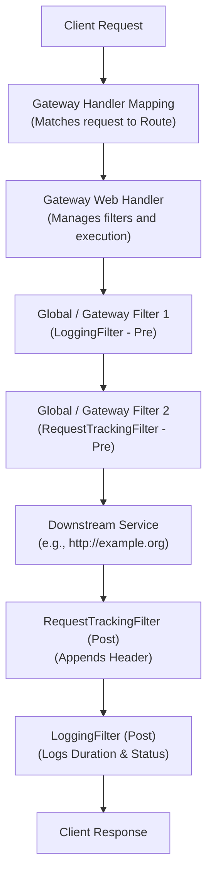
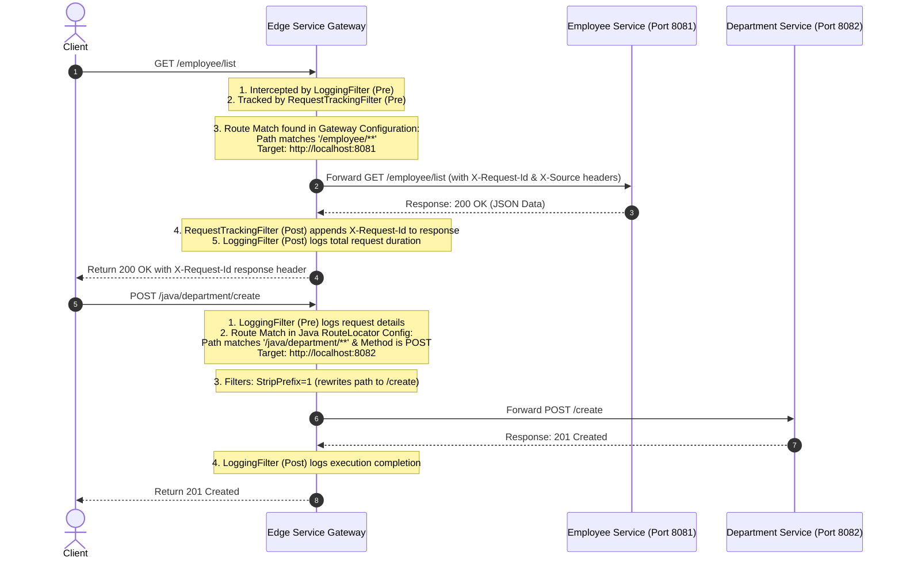
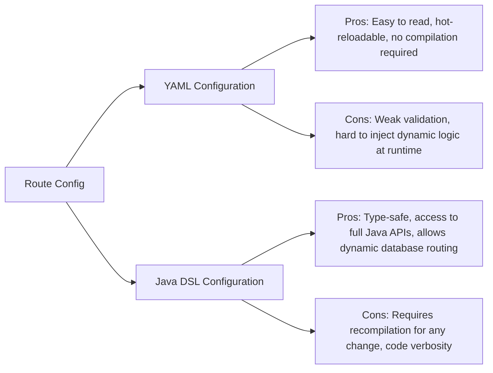
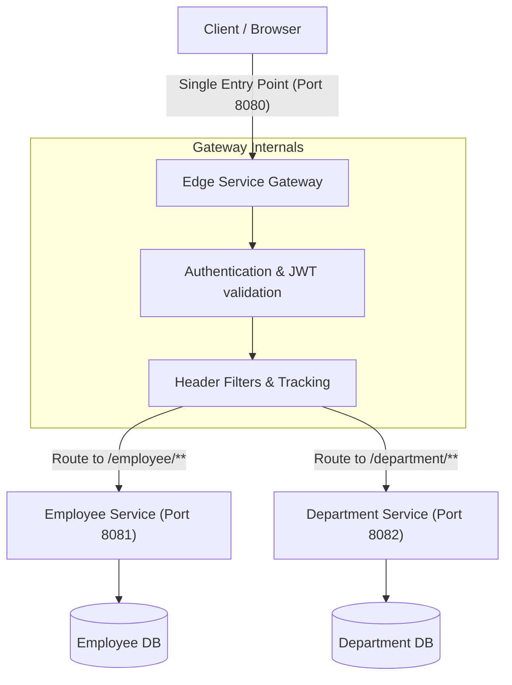

# Edge Services for Routing and Filtering: Technical Reference & Architecture Guide

This document provides a comprehensive overview of building, configuring, and running an API Gateway using **Spring Boot 3.4.x** and **Spring Cloud Gateway 2024.0.0 (Spring Cloud 2024.x)**.

---

## 1. Spring Cloud Gateway Architecture

### What is Spring Cloud Gateway?
**Spring Cloud Gateway** is a library built on top of Spring WebFlux, Spring Boot, and Project Reactor. It provides an API Gateway that is simple, yet effective, for routing requests to backend APIs while providing cross-cutting concerns such as security, monitoring/metrics, and resiliency.

### Why is it Used?
1. **Single Entry Point**: Standardizes access for client applications, simplifying security configurations (CORS, SSL, Auth).
2. **Cross-Cutting Concerns**: Offloads logging, rate limiting, header manipulation, and path rewriting from downstream services.
3. **Dynamic Routing**: Discovers and routes to microservices dynamically via service registries (like Eureka, Consul).
4. **Resiliency**: Integrates with Circuit Breaker (Resilience4j) and provides retries out of the box.

### Request Routing Core Concepts
Spring Cloud Gateway routes requests based on three main components:
* **Route**: The basic building block of the gateway. It is defined by an ID, a destination URI, a collection of predicates, and a collection of filters. A route is matched if the aggregate predicate is true.
* **Predicate**: Built using Java 8 `java.util.function.Predicate`. This allows developers to match on anything from the HTTP request, such as headers, cookies, query parameters, or paths.
* **Filter**: Instances of Spring Framework `GatewayFilter` or `GlobalFilter`. These allow requests and responses to be modified before or after sending the downstream request.

### Architectural Comparisons

| Component | Definition & Role | Comparison |
| :--- | :--- | :--- |
| **Gateway** | A generic system component acting as an entry point for data traffic. | Generic term, can be an API Gateway or storage/IoT gateway. |
| **Reverse Proxy** | Focuses on forwarding requests to backend servers, masking backend servers from the client. | Usually lightweight (e.g., Nginx, Apache HTTP Server). Lacks complex application-level routing. |
| **API Gateway** | A specialized reverse proxy that handles API-specific concerns (Auth, Rate Limiting, Logging, Circuit Breaking). | Highly customizable (e.g., Spring Cloud Gateway, Kong, Apigee). Contains business and routing logic. |
| **Load Balancer** | Distributes incoming network traffic across a cluster of servers to ensure high availability and resource utilization. | Operates primarily at Layer 4 (TCP/UDP) or Layer 7 (HTTP) purely for traffic distribution. |

### Gateway Architecture Diagram

The diagram below illustrates how client requests are mapped and processed through the Gateway Handler Mapping, Gateway Web Handler, and the Filter chains:



---

## 2. Gateway Routing Flows

### Detailed End-to-End Request Routing Flow

The routing flow below details the exact lifecycle of a request passing through the edge gateway down to backend services (Employee Service and Department Service):



---

## 3. Route Configuration Approaches

### YAML Configuration vs Java DSL Configuration
Spring Cloud Gateway supports defining routes either declaratively in `application.yml` or programmatically in Java code using a `RouteLocator` Bean.



### Direct Feature Comparison

| Feature | YAML Configuration | Java DSL Configuration |
| :--- | :--- | :--- |
| **Location** | `application.yml` or `application.properties` | Java Class with `@Configuration` / `@Bean` |
| **Syntax Check** | Checked at startup, prone to indentation errors. | Compile-time syntax checking by IDE and compiler. |
| **Dynamic Filters**| Configured via string references. | Directly injects Spring beans (e.g. `RequestTrackingFilter`). |
| **Logical Operators**| Limited to default YAML predicate structures. | Supports complex code logic like `.and()`, `.or()`, etc. |
| **Best Used For** | Static routing configs, environment-specific routes. | Custom filter integration, database-driven routing. |

---

## 4. Route Predicates Deep-Dive

Route Predicates match incoming HTTP requests to route destinations. Below are the key built-in predicates:

1. **Path Predicate**: Matches requests matching a glob path pattern.
   * *Example*: `- Path=/employee/**`
   * *When to Use*: To route requests to specific functional microservices (e.g., all employee-related requests go to Employee Service).
2. **Method Predicate**: Matches requests matching specified HTTP methods.
   * *Example*: `- Method=GET,POST`
   * *When to Use*: To restrict read-only endpoints to GET, or route write operations to a write-optimized database replica.
3. **Header Predicate**: Matches requests based on presence or regex match of HTTP headers.
   * *Example*: `- Header=X-Request-Source, ^Gateway.*$`
   * *When to Use*: Canary releases, routing request traffic based on client API version headers.
4. **Cookie Predicate**: Matches requests containing cookies matching a name and regex pattern.
   * *Example*: `- Cookie=user-type, premium`
   * *When to Use*: Routing premium users to dedicated high-performance server pools.
5. **Host Predicate**: Matches requests based on the Host header.
   * *Example*: `- Host=**.cognizant.com`
   * *When to Use*: Multi-tenant architectures where subdomains route to different tenant services.
6. **Query Predicate**: Matches requests containing a query parameter and optional regex.
   * *Example*: `- Query=debug, true`
   * *When to Use*: Routing debugging/diagnostic requests to mock servers or sandbox environments.
7. **Time-Based Predicates**: Matches requests occurring `Before`, `After`, or `Between` dates.
   * *Example*: `- After=2026-06-29T23:59:59+05:30[Asia/Kolkata]`
   * *When to Use*: Scheduled service maintenance windows, flash sale routing activations.

---

## 5. Gateway Filters Deep-Dive

Gateway Filters modify HTTP requests and responses at the gateway boundary.

* **AddRequestHeader**: Injects a custom header into the request before forwarding it downstream.
  * *Code/YAML*: `AddRequestHeader=X-Source, Gateway`
* **AddResponseHeader**: Appends a custom header to the outgoing client response.
  * *Code/YAML*: `AddResponseHeader=X-Processed-By, Gateway`
* **RemoveRequestHeader / RemoveResponseHeader**: Strips sensitive headers (e.g., `Cookie`, `Authorization`) before forwarding or returning.
  * *Code/YAML*: `RemoveRequestHeader=Cookie`
* **RewritePath**: Rewrites request path from one format to another using regex.
  * *Code/YAML*: `RewritePath=/old-api/(?<segment>.*), /new-api/$\{segment}`
* **StripPrefix**: Removes the specified number of segments from the request path.
  * *Code/YAML*: `StripPrefix=1` (converts `/employee/list` to `/list`)
* **PrefixPath / SetPath**: Prepends a prefix or explicitly sets the downstream request path.
  * *Code/YAML*: `PrefixPath=/api/v1`
* **Retry**: Automatically retries failed downstream requests based on HTTP status codes and exceptions.
  * *Config*: Configures backoff time, status codes (e.g. 500, 503), and series.
* **RequestRateLimiter**: Restricts request rates using Token Bucket algorithm (requires Redis or custom rate limiter). Prevents DDoS and API abuse.
* **CircuitBreaker**: Integrates Resilience4j to open a circuit when downstream service failures cross a threshold, returning a fallback response immediately instead of hanging.

---

## 6. Reactive Programming Concepts

### Spring WebFlux & Project Reactor
Traditional web frameworks (like Spring MVC) use a **Thread-per-request** model. If a request calls a slow downstream database, the handling thread is blocked, waiting for the database response. In high-traffic systems, this leads to thread exhaustion.

**Spring WebFlux** uses **Reactive Streams** for non-blocking asynchronous event processing. It runs on a small, fixed number of event-loop threads (Netty default) and registers callbacks for operations, meaning threads are never blocked waiting for I/O.

### Thread-per-Request (Spring MVC) vs Event-Loop (Spring WebFlux)

```mermaid
graph TD
    subgraph Spring MVC (Thread-per-Request)
        R1[Request 1] --> T1[Thread 1 - Blocked on DB I/O]
        R2[Request 2] --> T2[Thread 2 - Blocked on REST call]
        R3[Request 3] --> T3[Thread 3 - Exhausted waiting...]
    end
    subgraph Spring WebFlux (Event-Loop)
        W1[Request 1] --> EventLoop[Single Event Loop Thread]
        W2[Request 2] --> EventLoop
        W3[Request 3] --> EventLoop
        EventLoop --> AsyncIO[Non-blocking I/O Task]
        AsyncIO --> CompletedCallback[Register Callback & Return Thread to Loop]
    end
```

### Mono vs Flux
* **Mono**: A reactive publisher that emits **0 or 1** element, then completes.
  * *Example*: `Mono<ServerWebExchange>`, `Mono<Void>` (representing completion).
* **Flux**: A reactive publisher that emits **0 to N** elements, then completes.
  * *Example*: `Flux<Employee>` (streaming multiple records over time).

---

## 7. Folder Structure Explanation

Here is the folder structure generated in `src/main/java`:

```directory
com/cognizant/edgeservice
├── config                 # Programmatic configurations (Route definitions, beans)
├── filter                 # Global & custom filters intercepting request lifecycles
├── controller             # Gateway controllers (e.g. fallback endpoints)
├── route                  # Core route model definitions (if dynamically generated)
├── service                # Business logic (e.g., dynamic routing provider)
├── exception              # Reactive GlobalExceptionHandler and custom exceptions
├── util                   # Utility classes (e.g., headers or logging context helpers)
└── EdgeServiceApplication.java
```

* **config**: Contains Java DSL classes like `GatewayRouteConfig.java` to define programmatic gateway beans.
* **filter**: Houses `LoggingFilter.java` and `RequestTrackingFilter.java` to intercept incoming/outgoing web packets.
* **controller**: Useful for fallback mappings when circuit breakers open.
* **exception**: Contains custom classes that override Spring's default error behavior to output structured JSON responses.

---

## 8. Microservices Single Entry Point Architecture

In a microservices architecture, exposing all services directly to clients introduces complex cross-origin resource sharing (CORS), security management, and authentication overhead. The Edge API Gateway solves this:



---

## 9. Testing Guide & cURL Commands

### cURL Commands & Expected Outputs

#### 1. Test Routing to http://example.org
```bash
curl -i -X GET http://localhost:8080/example/test
```
**Expected Console Logging (Gateway Logs)**:
```text
[PRE-FILTER] Incoming Request - Method: GET, URI: /example/test, Headers: [...]
[POST-FILTER] Outgoing Response - URI: /example/test, Status: 200 OK, Execution Time: 245 ms
```
**Expected HTTP Response Headers**:
```text
HTTP/1.1 200 OK
X-Example-Response: GatewayVal
X-Request-Id: 8ef621f3-d021-4f9e-bd9d-5bb7700a0cfb
```

#### 2. Test Actuator Health
```bash
curl -i -X GET http://localhost:8080/actuator/health
```
**Expected Response**:
```json
{
  "status": "UP",
  "components": {
    "gateway": {
      "status": "UP"
    },
    "ping": {
      "status": "UP"
    }
  }
}
```

#### 3. Test Actuator Gateway Routes
```bash
curl -i -X GET http://localhost:8080/actuator/gateway/routes
```
**Expected Response**:
A list containing JSON representations of routes defined in `application.yml` and `GatewayRouteConfig.java`.

#### 4. Test 404 Route Not Found via Global Exception Handler
```bash
curl -i -X GET http://localhost:8080/invalid/route
```
**Expected Response**:
```json
{
  "timestamp": "2026-06-29T22:50:12.456",
  "status": 404,
  "error": "Not Found",
  "message": "Requested route or downstream resource not found.",
  "path": "/invalid/route",
  "exceptionType": "ResponseStatusException",
  "trackingId": "e3a89e1a-c715-4672-8f19-3ee4de180d5d"
}
```

---

## 10. Actuator Endpoints Explained
* `/actuator`: Exposes a discovery index of all enabled Actuator endpoints.
* `/actuator/health`: Provides diagnostic health of the gateway and its components.
* `/actuator/gateway/routes`: Lists all mapped gateway routes. Extremely useful in production for debugging route match orders.

---

## 11. Common Errors and Solutions

* **404 Route Not Found**: The route pattern (Path Predicate) does not match the URL, or the downstream service returned a 404. Verify predicates.
* **503 Service Unavailable**: Gateway cannot communicate with downstream service because it's offline or not registered in Discovery. Check port status of target microservices.
* **Connection Refused**: Target server is offline. Check if service is listening on port configured in gateway (`8081` / `8082`).
* **Gateway Timeout**: Downstream service is executing too slowly. Increase Netty routing connection timeouts in gateway properties.
* **Reactive Bean Errors**: Declaring blocking dependencies (e.g. Spring Security without `reactive` flag, or traditional JPA dependencies) inside a WebFlux gateway blocks the Netty thread pool. Ensure only reactive drivers (R2DBC, WebFlux client) are used.
* **Dependency Conflicts**: Mixing `spring-boot-starter-web` and `spring-boot-starter-webflux` in a gateway project creates startup failure. Remove the servlet dependency (`spring-boot-starter-web`).

---

## 12. Best Practices
1. **API Gateway Pattern**: Route all UI or external traffic through the Gateway; do not expose internal microservice ports to public networks.
2. **Centralized Logging**: Generate a Correlation ID (Request ID) at the Gateway (using custom tracking filters) and pass it downstream using request headers to trace logs across microservices.
3. **Rate Limiting**: Implement rate limiting at the edge service to shield downstream databases and microservices from request spikes.
4. **Resiliency**: Wrap all third-party and unstable microservice calls in a Circuit Breaker filter.

---

## 13. Interview Questions & Answers

### 1. What is Spring Cloud Gateway?
**Answer**: It is a reactive API Gateway built on Spring Boot 3, Spring WebFlux, and Project Reactor, designed to route incoming requests to microservices while providing cross-cutting features like logging, security, and metrics.

### 2. How does Spring Cloud Gateway differ from Zuul 1.x?
**Answer**: Zuul 1.x is blocking (Thread-per-request model based on Servlet API), while Spring Cloud Gateway is built on non-blocking WebFlux (Netty server), allowing it to handle higher volumes of concurrent requests with fewer threads.

### 3. What are the three core building blocks of Spring Cloud Gateway?
**Answer**: Route (ID, destination URI, predicates, filters), Predicate (conditions to match request), and Filter (logic to modify requests/responses).

### 4. What is a Global Filter in Spring Cloud Gateway?
**Answer**: A filter implementing `GlobalFilter` that is applied globally to all routes in the gateway without explicit configuration per route.

### 5. Why should we avoid including `spring-boot-starter-web` in a Spring Cloud Gateway project?
**Answer**: Spring Cloud Gateway requires a reactive environment (`spring-boot-starter-webflux`). Including the standard Web servlet starter will cause port conflicts and runtime startup errors due to Spring Boot trying to boot Tomcat instead of Netty.

### 6. How does request routing work in Spring Cloud Gateway?
**Answer**: Incoming requests are mapped to a Route if all of its Predicates are satisfied. The Web Handler then executes a chain of Gateway Filters (Pre-phase), sends the request downstream, and runs the Post-phase of the filters on the response.

### 7. How do you implement a custom filter in Spring Cloud Gateway?
**Answer**: By implementing the `GatewayFilter` interface (for route-specific routing) or `GlobalFilter` (for all routes), and overriding the `filter(ServerWebExchange, GatewayFilterChain)` method.

### 8. What is the difference between a Pre-filter and a Post-filter?
**Answer**: A Pre-filter executes logic *before* routing the request downstream. A Post-filter executes logic *after* getting the response from the downstream service (usually inside a `.then(Mono.fromRunnable(...))` block).

### 9. What algorithm is used by default in Spring Cloud Gateway's RequestRateLimiter?
**Answer**: The Token Bucket algorithm, typically backed by Redis.

### 10. How can you expose gateway routes dynamically?
**Answer**: By enabling the Actuator endpoint `management.endpoint.gateway.enabled=true`, routes can be viewed, created, and deleted at runtime using HTTP calls.

### 11. What is the purpose of the `StripPrefix` filter?
**Answer**: It removes a specified number of path segments from the request before forwarding it downstream. For example, `StripPrefix=1` converts `/employee/list` to `/list`.

### 12. How does the `Retry` filter work?
**Answer**: It intercepts downstream errors and retries the request a configured number of times, applying backoff delays to prevent overloading the downstream service.

### 13. What is WebFlux?
**Answer**: A reactive, non-blocking web framework introduced in Spring 5 to support reactive streams and high concurrency with low resource utilization.

### 14. What are Mono and Flux?
**Answer**: They are implementations of the Reactive Publisher interface. `Mono` represents 0 or 1 item, whereas `Flux` represents a stream of 0 to N items.

### 15. What is the role of an Event Loop in reactive gateways?
**Answer**: It is a single-threaded loop that continuously processes I/O events, delegating tasks and executing callbacks asynchronously. This prevents threads from blocking on resource I/O.

### 16. How do you handle exceptions globally in Spring Cloud Gateway?
**Answer**: By implementing the `ErrorWebExceptionHandler` interface and registering it with high precedence (e.g., `@Order(-2)`) to intercept all routing and network exceptions and return a structured JSON response.

### 17. How do you propagate a tracking ID across microservices?
**Answer**: Create a gateway filter that generates a UUID, attaches it to the request as a header (e.g., `X-Request-Id`), and configures downstream microservices to read this header and include it in their logs (MDC).

### 18. What is a Gateway Circuit Breaker?
**Answer**: A filter that integrates with a tool like Resilience4j to monitor downstream failure rates. If failures exceed a threshold, it trips open to immediately return a fallback response, preventing cascade failure.

### 19. How do predicates differ from filters?
**Answer**: Predicates are conditional tests (Boolean checks on paths, headers, query params) to decide *if* a route should be matched. Filters are actions that *modify* the HTTP request or response.

### 20. What version of Java is recommended for Spring Boot 3 & Spring Cloud 2024?
**Answer**: Java 17 or higher (Java 17 is the baseline for Spring Boot 3).
